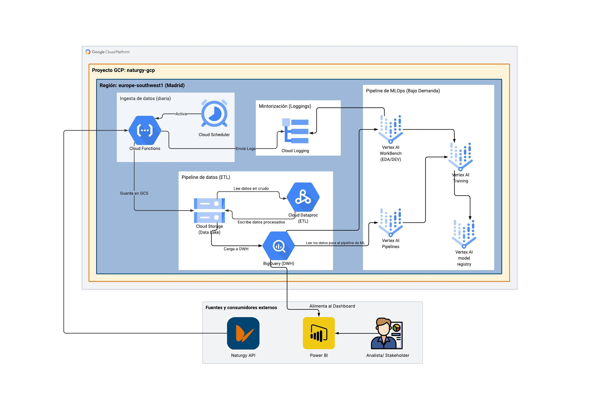

# Proyecto Final Máster: Análisis Energético y Predicción para Naturgy

## 1. Introducción y Contexto del Proyecto Naturgy

Este proyecto se enmarca en el trabajo final del máster, con el objetivo de aplicar los conocimientos adquiridos en Big Data e Inteligencia Artificial para resolver un caso de uso práctico. El proyecto se centra en la empresa ficticia Naturgy en el año 2019, buscando impulsar el uso de energía eléctrica y obtener una comprensión más profunda del mercado energético español.

Los datos principales para este análisis provienen de un [conjunto de datos público de Kaggle](https://www.kaggle.com/datasets/nicholasjhana/energy-consumption-generation-prices-and-weather), que incluye información horaria sobre el consumo eléctrico, generación por tipo de fuente, precios y datos climáticos en España para el período 2015-2018.

### Objetivos Generales del Análisis para Naturgy:
- Obtener insights sobre el consumo de energías renovables versus fósiles.
- Analizar la influencia del clima en la producción y demanda energética.
- Identificar patrones temporales en el consumo de diferentes tipos de energía.
- Evaluar la evolución del consumo energético y las tendencias futuras.
- Predecir con mayor precisión el precio y la demanda de energía.
- Identificar oportunidades para fomentar energías subutilizadas.

## 2. Caso de Uso Detallado

**Contexto:** Naturgy, en 2019, busca fortalecer su posición en el mercado eléctrico, promoviendo la energía eléctrica en línea con los requisitos gubernamentales, el crecimiento empresarial y los objetivos de sostenibilidad.

**Problema de Negocio:** La empresa necesita una mejor comprensión de la dinámica del mercado energético español, incluyendo cómo factores como el clima y los patrones de consumo afectan la generación y los precios. Esto permitirá una planificación más eficiente, optimizar la generación de energía renovable y mejorar las estrategias de mercado.

**Preguntas Clave a Responder:**
- ¿Cómo influye el clima de las principales ciudades españolas en la producción y demanda energética?
- ¿En qué períodos se consumen más energías renovables y de qué factores depende?
- ¿Cuál es la evolución histórica del consumo y hacia dónde tiende el mercado?
- ¿Qué tipos de energía son los más consumidos por hora?
- ¿Cómo se pueden mejorar las predicciones de precio y demanda energética utilizando datos climáticos?
- ¿Qué energías poco utilizadas tienen potencial de crecimiento y cómo pueden las condiciones climáticas locales guiar su fomento?
- ¿Cuál es el margen de error de las predicciones actuales del TSO y cómo se compara con nuestros modelos predictivos más avanzados?

## 3. Datasets Utilizados

Se utilizan dos datasets principales, ambos con granularidad horaria para el período 2015-2018:

### a. Energy Dataset (`energy_dataset.csv`)
- **Contenido:** Datos de generación de energía por múltiples fuentes (biomasa, fósiles, nuclear, solar, eólica, etc.), pronósticos de generación, demanda total (real y pronosticada) y precios de mercado (real y día siguiente) en España.
- **Columnas Clave para el Análisis:** `time`, `generation solar`, `generation wind onshore`, `total load actual`, `price actual`.

### b. Weather Features Dataset (`weather_features.csv`)
- **Contenido:** Datos meteorológicos horarios para Valencia (y originalmente para las 5 ciudades más grandes de España, aunque para este proyecto nos centraremos en la información disponible y relevante). Incluye temperatura, presión, humedad, velocidad y dirección del viento, nubosidad y precipitación.
- **Columnas Clave para el Análisis:** `dt_iso` (timestamp), `temp`, `wind_speed`, `clouds_all`, `weather_main`.

**Relación entre Datasets:** Los datasets se pueden unir por sus columnas temporales (`time` y `dt_iso`) para realizar análisis integrados, correlacionando las condiciones climáticas con la generación, la demanda y los precios de la energía.

## 4. Arquitectura de la Solución

La solución propuesta se basa en una arquitectura moderna y escalable, utilizando principalmente servicios de Google Cloud Platform (GCP), Apache Spark para el procesamiento ETL, y Power BI para la visualización.

**Componentes Tecnológicos Principales:**
*   **Fuentes de Datos:** Archivos `energy_dataset.csv` y `weather_features.csv`.
*   **Google Cloud Storage (GCS):** Data Lake para almacenar datos crudos y procesados (en formato Parquet).
*   **Apache Spark (en Google Cloud Dataproc):** Motor para ETL (Extracción, Transformación y Carga), incluyendo limpieza, transformación, unión de datasets y aplicación de reglas de calidad.
*   **Google BigQuery:** Data Warehouse para almacenar los datos procesados y validados, sirviendo como fuente para Power BI y Vertex AI.
*   **Google Cloud Logging:** Para monitorización y análisis de logs de los procesos ETL.
*   **Microsoft Power BI:** Herramienta de Business Intelligence para crear dashboards interactivos que permitan el análisis de datos y la comprensión del caso de uso.
*   **Google Vertex AI Workbench / AI Platform:** Entorno para desarrollo de modelos de Machine Learning (análisis exploratorio, ingeniería de características, entrenamiento, evaluación y despliegue de modelos predictivos).

## 5. Fases y Metodología del Proyecto

El proyecto se divide en dos grandes bloques, siguiendo las directrices generales del máster:

### Bloque Big Data
1.  **Selección set de datos y definición caso de uso:** Completado (Naturgy).
2.  **Documentación:** Modelo de datos y plan de pruebas.
3.  **Implementación ingesta y modelado:** Ingesta de datos en GCS, procesamiento y transformación con Spark en Dataproc, carga en BigQuery.
4.  **Revisión de calidad del dato:** Asegurar la fiabilidad de los datos mediante técnicas de validación y limpieza.
5.  **Implementación dashboard PBI:** Creación de un cuadro de mando en Power BI conectado a BigQuery para visualización y análisis.
6.  **Ejecución plan de pruebas:** Aplicación de pruebas de integridad, unicidad, etc.

### Bloque Inteligencia Artificial
1.  **Feature engineering:**
    *   Análisis de distribución de variables.
    *   Estudio de correlaciones.
    *   Evaluación de reducción de dimensionalidad.
    *   Análisis del balanceo de datos.
    *   Creación de una función para preprocesamiento de datos.
2.  **Entrenamiento del modelo:**
    *   Experimentación con múltiples modelos (mínimo 2, incluyendo una red neuronal).
    *   Justificación de la elección de algoritmos e hiperparámetros.
    *   Para la red neuronal: explicación de la función de activación de la capa de salida y la función de pérdida.
    *   Comparación de métricas en sets de entrenamiento y test.
    *   Selección del mejor modelo, asegurando la reproducibilidad.

## 6. Tecnologías Principales
- **Lenguajes de Programación:** Python (con PySpark, Pandas, NumPy).
- **Machine Learning:** Scikit-learn, TensorFlow/Keras.
- **Bases de Datos y Almacenamiento:** Google Cloud Storage, Google BigQuery.
- **Procesamiento de Datos:** Apache Spark (en Google Cloud Dataproc).
- **Visualización:** Microsoft Power BI.
- **Cloud Platform:** Google Cloud Platform (GCP).
- **Otros:** SQL, Jupyter Notebooks.

## 7. Entregables del Proyecto Naturgy
Los entregables específicos para este proyecto incluirán:
*   **Código:** Scripts de PySpark para ETL, notebooks de Jupyter para análisis y modelado de IA.
*   **Dashboard:** Archivo `.pbix` de Power BI.
*   **Documentación:**
    *   Documentación del modelo de datos.
    *   Documentación del plan de pruebas y evidencias de ejecución.
    *   Informe de IA (máximo 3 páginas) detallando el origen de datos, feature engineering, modelos, métricas y elección final.
    *   Material de apoyo para la exposición final.

## 8. Documentación Adicional

Para una comprensión más profunda del mercado energético español y el contexto del proyecto, se han creado los siguientes documentos adicionales:

- **[Contexto Energético en España (2015–2018)](Documentación_general/contexto_energetico.md):** Un análisis detallado de la demanda, generación, precios y regulación del sector eléctrico en el período de estudio.
- **[Funcionamiento del Sistema Eléctrico Español](Documentación_general/sistema_electrico_espanol.md):** Una explicación de las fases (generación, transporte, distribución, comercialización) y los agentes que intervienen en el mercado eléctrico español.

## 9. Próximos Pasos / Hoja de Ruta

Este documento sirve como guía central para el desarrollo del proyecto. Los próximos pasos se centrarán en la ejecución de las fases de Big Data e Inteligencia Artificial descritas anteriormente, siguiendo el calendario tentativo del máster. El progreso se documentará en las respectivas carpetas y archivos del proyecto.
